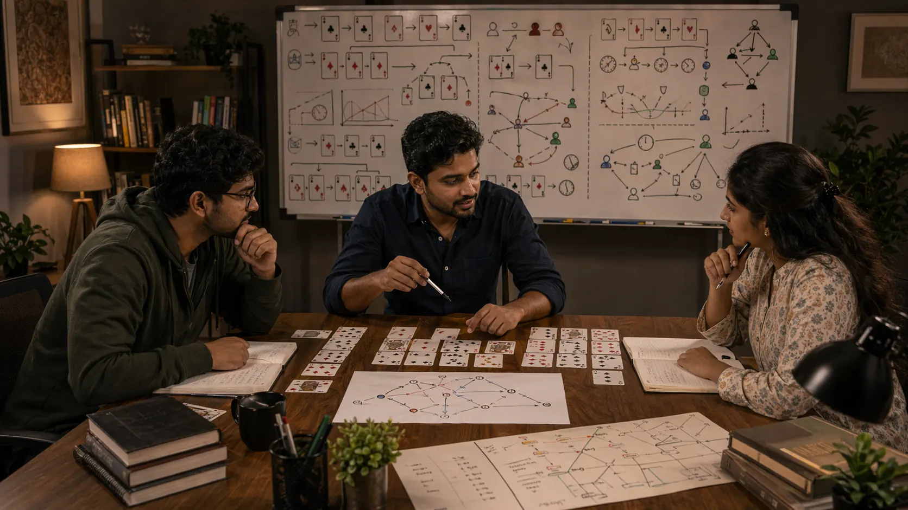

# Advanced Concepts In Indian Card Games: Higher-Level Ideas That Still Need Practical Use

## Introduction

Advanced concepts in Indian card games matter because experienced players eventually need more than basic hand reading. They need to think about layered information, adaptive opponents, timing shifts, and how one decision shapes later reactions.

This page explains those deeper ideas in a practical way so they stay useful instead of sounding complicated for their own sake.

---

## Advanced Concepts Overview

---

## What Makes A Concept Advanced?

An advanced concept is deeper card-game thinking that becomes useful after the fundamentals are already steady. It usually involves combining several clues, planning for reactions, or understanding how image and adaptation affect the value of a move.

The purpose of advanced study is clarity, not decorative complexity.

---

# 1. Layer Information Carefully

Advanced play often depends on combining clues instead of trusting one signal too much. Behavior, rhythm, visible card flow, and previous tendencies all matter more when read together.

But layering information has a danger: it can also layer noise. Selectivity matters.

# 2. Respect Adaptive Opponents

Some players change once they notice your habits. Advanced thinking becomes useful when it helps you recognize that the table is no longer reacting passively.

This is where image, variation, and disguised intent begin to matter more.

# 3. Value The Marginal Spot

Many deeper lessons come from close hands and awkward rounds rather than obvious ones. Marginal spots reveal whether the player actually understands why one line is stronger than another.

Players who want to improve at advanced concepts should save the uncertain spots, not only the painful ones.

# 4. Think About Future Reactions

An advanced choice is often judged not only by what it does now, but by what it invites next. Strong players ask how the table is likely to answer the current move.

That future response often decides whether the advanced line is truly useful.

# 5. Use Table Image Practically

In some card games, the way others read your style affects how much pressure your decisions create. Advanced concepts help players think about that image without turning it into theatre.

Table image is useful only when it improves practical decisions.

# 6. Avoid Decorative Complexity

One of the biggest advanced-level mistakes is choosing a deep-looking line mainly because it feels clever. The stronger line is often the one that improves the position most practically.

Complexity does not prove depth. It often proves that the player wanted the move to feel special.

# 7. Connect Advanced Ideas To Fundamentals

Deeper concepts are useful only when they refine the basics. If they are replacing basic honesty about hand strength, timing, or pressure, they are probably hurting more than helping.

Advanced language should sharpen the base, not cover for its weakness.

# 8. Review Whether Depth Added Value

After the game, it helps to ask whether the advanced idea actually improved the line. Did it create clarity, flexibility, or stronger pressure? Or did it only make the choice harder to explain?

For many readers, the most useful path into this topic is through [Strategic Thinking In Indian Card Games](./strategic-thinking.md) and [Pattern Recognition In Indian Card Games](./pattern-recognition.md).

---

## Real Session Example

Advanced mistakes often begin with a line that sounds impressive in review language. The player considered image, timing, opponent adjustment, and several layers of information. But when the spot is reviewed honestly, the simpler line may have been clearer and almost as valuable.

This does not mean advanced thinking is bad. It means advanced thinking must earn its place. If layering information does not improve clarity, it may only create a story that makes an ordinary decision harder.

A useful advanced line should answer a real problem in the position. If the position does not need it, restraint is the higher-level skill.

---

## Why Advanced Concepts Get Misused

Advanced concepts get misused when players want to feel ahead of the table. The language of high-level play can become attractive by itself: deception, adaptation, reverse pressure, tempo control, image management.

Another reason is selective review. A player remembers the one advanced line that worked and forgets the ordinary spots where similar complexity created avoidable mistakes. Without honest review, advanced ideas become stories of identity instead of tools.

The strongest advanced players are not the ones who use complex ideas most often. They are the ones who know when the spot deserves them.

---

## How To Study Advanced Concepts Safely

Use marginal spots as your training ground. Avoid reviewing only obvious wins or obvious mistakes. Marginal spots force players to compare small trade-offs, information quality, and future reactions much more honestly.

When you apply an advanced concept, write down what it was supposed to improve. Did it improve timing? Protect against an adjustment? Make a future response easier? If you cannot answer clearly, the concept may not have been necessary.

Advanced study should sharpen fundamentals. If it makes you less honest about position quality, awareness, or risk, step back and rebuild the base.

---

## Common Mistakes

- Using advanced language to hide a basic reading mistake.
- Forcing complexity into ordinary positions.
- Treating one successful deep line as proof that it is broadly reliable.
- Building a story from too many weak clues.
- Studying high-level ideas before the fundamentals are stable.

---

## FAQ

### When should I start studying advanced concepts?

Usually after your fundamentals, decision making, and review habits feel reasonably stable across many sessions.

### Are advanced concepts only for expert players?

Not entirely, but they help most when the basics no longer consume all of your attention.

### How do I know I am forcing advanced play?

If the line mainly feels clever rather than clearly useful, that is a warning sign.

### What is the best way to practice advanced concepts?

Review marginal spots, not just obvious ones, and check whether the concept changed later decisions in a useful way.

### What is the clearest warning sign that advanced thinking is hurting me?

If your explanation becomes longer while the decision becomes less clear, you may be using advanced language to cover uncertainty.

---

## Summary

Advanced concepts in Indian card games become valuable when they sharpen practical judgment instead of replacing it. The strongest takeaway is to use higher-level ideas selectively and judge them by whether they improve real decisions.

---

## SEO Keywords

advanced concepts in Indian card games
card game strategy
Indian card game guide
advanced card game thinking
table adaptation

## Related Pages
- [Indian Card Games Fundamentals](./fundamentals.md)
- [Strategic Thinking In Indian Card Games](./strategic-thinking.md)
- [Pattern Recognition In Indian Card Games](./pattern-recognition.md)
- [Decision Making In Indian Card Games](./decision-making.md)
