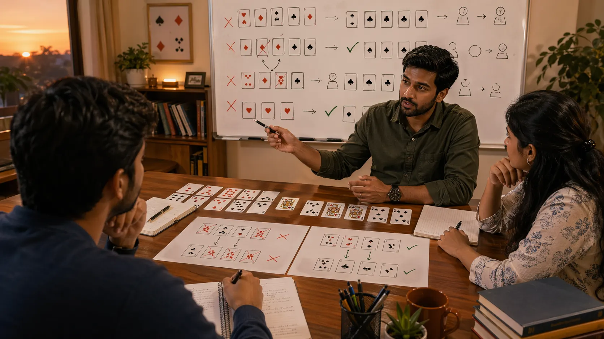

# Common Mistakes In Indian Card Games

## Introduction

Common mistakes in Indian card games matter because repeated small errors often cost more than one dramatic blunder. Many players do not lose because they misunderstood the rules. They lose because they repeat the same weak habits in reading, timing, and table discipline.

This page focuses on the mistakes that show up across many card games and explains how readers can notice them earlier.

---

## Common Mistakes Overview

---

## What Counts As A Common Mistake?

A common mistake is a repeated error in judgment that appears across different tables, hands, and game types. It may involve overcommitting too early, reading too much into one clue, chasing recovery after a weak turn, or ignoring how the table has changed.

---

# 1. Overvaluing One Good Sign
Readers often become too confident because of one favorable clue. A strong card, one passive opponent, or one earlier success can distort the whole read. Good play usually needs more than one reason.

# 2. Ignoring Table Context
Some players judge the hand in isolation and forget the surrounding table rhythm. That creates mistakes in pressure timing, defensive judgment, and value protection because the wider situation is no longer being read clearly.

# 3. Playing Too Fast After Comfort
A player who feels comfortable may stop checking details. This often leads to lazy card management, weak sequencing, or table reads that were never updated after the round changed.

# 4. Playing Too Hard After Discomfort
The opposite mistake is trying to recover too aggressively just because the round feels awkward. Many avoidable losses begin when a player reacts emotionally to an uncomfortable spot instead of treating it as a situation that still needs a clear read.

# 5. Confusing Action With Strength
Activity is not always proof of control. In many card games, visible action may come from insecurity, urgency, or limited options. Treating every active line as strong creates unnecessary mistakes in response.

# 6. Failing To Update
A read that was useful earlier can become harmful later. Common mistakes often come from holding onto an old story about the table even after the visible facts have shifted.

# 7. Reviewing Only The Result
One of the most damaging habits is using the result as the only lesson. This hides repeated decision errors because a weak process can still survive one favorable outcome.

# 8. Repeating Habits That Once Worked
Many habits become sticky because they once produced a satisfying win. A reader improves faster when each habit is tested against repeated situations rather than protected by one memory.

---

## Common Mistakes

- Building a strong read from one clue instead of several.
- Refusing to update after the table has clearly changed.
- Letting the result hide the weakness of the process.

---

## Summary

Common mistakes in Indian card games are valuable to study because they reveal the hidden habits behind repeated losses and missed value. The more honestly readers group those errors, the faster their reviews become useful.

---

## SEO Keywords

common mistakes in Indian card games
card game strategy mistakes
Indian card game guide
card game errors
table reading mistakes

## Related Pages
- [Indian Card Games Fundamentals](./fundamentals.md)
- [Indian Card Games Game Awareness](./game-awareness.md)
- [Indian Card Games Pattern Recognition](./pattern-recognition.md)
- [Indian Card Games Play Styles](./play-styles.md)
