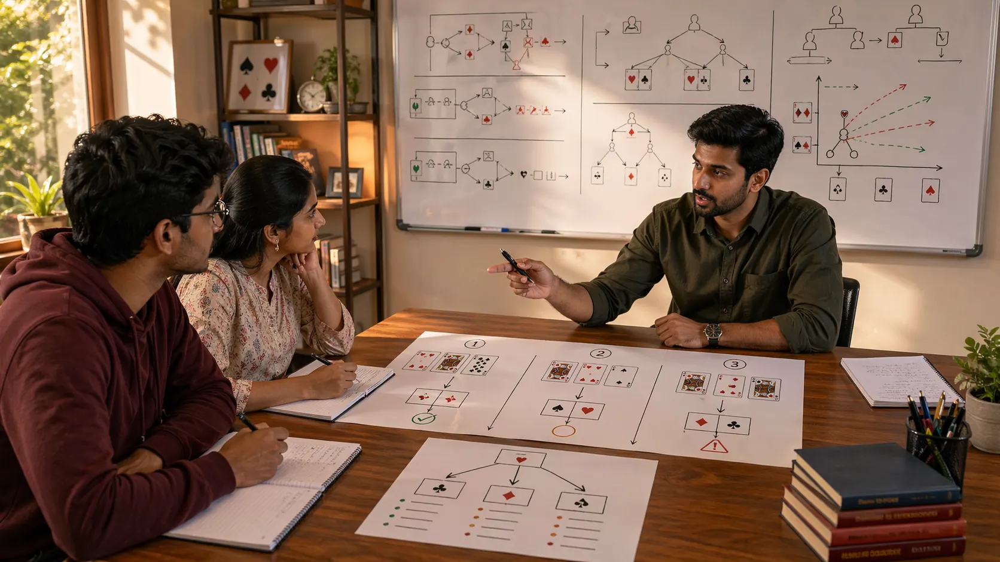

# Decision Making In Indian Card Games: How To Choose Well Under Pressure

## Introduction

Decision making in Indian card games matters because many close rounds are decided long before the final result appears. A player can know the rules, understand the hand, and still lose value by choosing too quickly, trusting a thin read, or solving the wrong problem.

This page treats decision making like real player review notes would. It looks at how strong choices are built, what false certainty feels like during live play, why pressure gets misread, and how to build a process that stays useful when the table becomes tense.

---

## Decision Making Overview

---

## What Is Decision Making In Card Games?

Decision making in card games is the process of comparing options under uncertainty. It includes judging hand quality, ranking the available information, respecting timing, and choosing the line that best fits both the current position and the likely next phase of the round.

A sound decision is not automatically a winning result. It is a choice that makes sense given what was realistically knowable at the time.

---

# 1. A Good Decision Starts Before The Move

Most weak decisions are already weak before the final action happens. The player entered the spot without enough observation, ignored a change in rhythm, or let a previous result distort the current read.

That is why decision making begins earlier than most players think. You are not only choosing a move. You are managing the quality of the inputs that lead to the move.

# 2. Information Quality Matters More Than Confidence

Players often confuse confidence with clarity. The feeling of certainty can be strong even when the evidence is thin. In real review notes, this often sounds like, "I was sure that had to be the spot," followed by very little support.

A better question is not "how sure do I feel?" but "how strong is the information behind this read?" Once those two are separated, many rushed decisions start looking avoidable.

# 3. The Best Process Is Usually Short

Under pressure, a long decision checklist is hard to use. Strong players often rely on a short process: what is the real pressure, what is the downside if I am wrong, and what does this do to the next decision?

That process works because it is practical enough to survive real play. Good decision making is rarely about more drama. It is usually about cleaner structure.

# 4. Why Players Rush Otherwise Good Spots

Many rushed decisions come from discomfort, not necessity. The position feels awkward, uncertainty builds, and action starts to look better simply because it ends the tension.

This is one of the biggest decision-making leaks. A move that ends discomfort is not always the move that improves the position.

# 5. Strong Decisions Respect The Next Turn

A useful way to judge a decision is to ask what it creates next. Some moves produce short-term value but make the following choice much harder. Others keep the position easier to read, easier to recover, or easier to adapt if the table shifts.

Decisions become stronger when they are judged not only by immediate effect, but by the shape they create afterward.

# 6. Misjudgment Often Comes From Naming The Spot Wrong

Players improve quickly when they classify situations more accurately. Is this a pressure spot, a control spot, a protection spot, or a recovery spot? The label matters because the response changes with it.

Many weak decisions happen because the player solved the wrong kind of problem. Once the spot is named correctly, the move often becomes clearer.

# 7. Real Improvement Comes From Decision Review

Volume alone does not sharpen decision making. Players learn more from reviewing a few close decisions carefully than from letting many unclear ones disappear without reflection.

The strongest review spots are usually not the obvious ones. They are the ones that felt nearly even, emotionally charged, or unclear at the time.

# 8. Build One Reliable Rule At A Time

Trying to become "a better decision maker" all at once is too vague. It is more practical to build one reliable rule. Maybe you pause when urgency feels emotional. Maybe you always name the downside before taking a thin line. Maybe you always check what changed since the previous turn.

These small rules matter because they improve decisions while the position is still flexible. Over repeated sessions, that is how decision quality becomes part of your natural game.

Readers who want to deepen this process should pair this page with [Strategic Thinking In Indian Card Games](./strategic-thinking.md) for planning and [Scenarios In Indian Card Games](./scenarios.md) for review through real situations.

---

## Real Session Example

One of the most common decision traps is false urgency. The table feels uncomfortable, a recent result is still in your mind, and the next action seems like it must happen immediately. In review, the position often had more room than you believed.

Imagine a spot with two possible lines: one forceful, one patient. The forceful line feels satisfying because it ends uncertainty. The patient line feels uncomfortable because it asks you to keep observing. Strong players do not choose patience automatically, but they do ask whether urgency is real or emotional.

That small question often changes the whole decision. If the danger is immediate, action may be right. If the danger is only felt pressure, acting too soon may create the very problem you were trying to solve.

---

## Why Players Misread Decision Spots

Weak decisions are not always caused by missing information. Sometimes the information is available, but the player weights it badly. A recent win makes a thin line feel stronger. A recent mistake makes a normal risk feel dangerous. A familiar pattern makes the current spot look more certain than it is.

This is why decision quality depends on naming the spot correctly. If the player thinks a recovery spot is an attack spot, or a protection spot is an opportunity spot, the move will often be wrong even with decent observation.

Good decision making is less about feeling sure and more about using the right process for the type of uncertainty you actually face.

---

## How To Train Better Decisions

Use a short three-step rule during play: identify the real pressure, name the main downside, and ask what the next decision will look like. This is simple enough to remember and strong enough to improve many close spots.

After the session, review only two or three decisions. More than that often becomes noise. For each one, write what you knew, what you assumed, what you ignored, and what line you would test next time.

Over time, patterns appear. You may discover that your worst decisions happen after comfort, after frustration, or when a spot has two reasonable-looking lines. That is much more useful than a vague goal like "decide better."

---

## Common Mistakes

- Trusting confidence more than the quality of the underlying information.
- Rushing because uncertainty feels uncomfortable.
- Ignoring how the current move changes the next one.
- Solving the wrong problem because the spot was misclassified.
- Reviewing only results instead of the logic available at the time.

---

## FAQ

### What makes a decision good if it still loses?

A good decision is a choice that made sense from the information available at the time. Results matter, but they are not the whole evaluation.

### How can I make better decisions faster?

Use a shorter process, not a more dramatic one. Clear questions usually help more than bigger instincts.

### Why do I make worse decisions after one bad result?

Recent outcomes often distort confidence, urgency, and risk tolerance before you notice it happening.

### Should I review every decision after a session?

No. Focus first on the unclear, costly, or emotionally charged ones. Those usually teach the most.

### What is the best first decision rule to practice?

Name the downside before taking a thin line. That small pause often exposes whether the decision is disciplined or impulsive.

---

## Summary

Decision making in Indian card games improves when players slow down just enough to judge pressure, timing, and practical outcomes more honestly. The strongest takeaway is that a reliable process is usually worth more than one dramatic correct guess.

---

## SEO Keywords

decision making in Indian card games
card game strategy
Indian card game guide
card game decisions
table decisions

## Related Pages
- [Indian Card Games Fundamentals](./fundamentals.md)
- [Risk Balance In Indian Card Games](./risk-balance.md)
- [Scenarios In Indian Card Games](./scenarios.md)
- [Strategic Thinking In Indian Card Games](./strategic-thinking.md)
