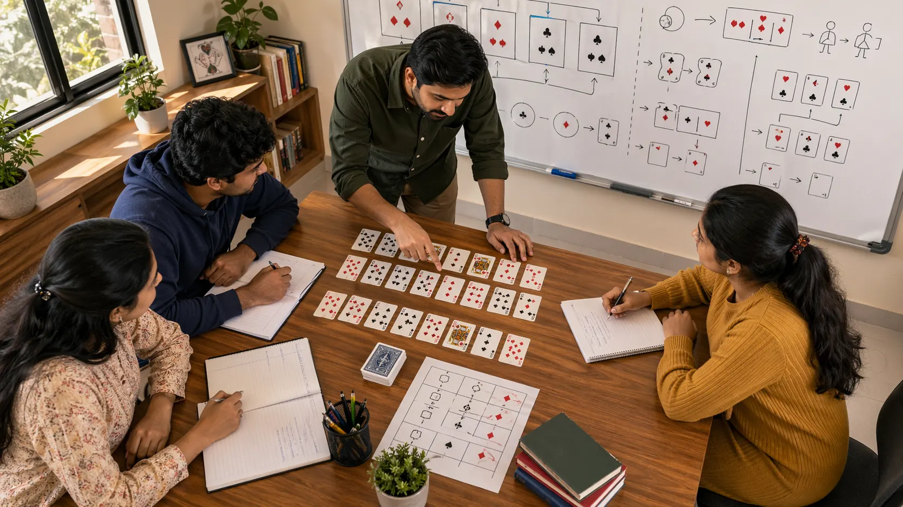

# Indian Card Games Fundamentals: The Habits That Keep Every Round More Stable

## Introduction

Indian card games fundamentals matter because strong play rarely begins with a clever trick. It usually begins with better hand judgment, clearer table reading, and fewer avoidable mistakes in ordinary spots. When players feel inconsistent, the problem is often not a lack of effort. It is a weak foundation underneath the later decisions.

This page is written like real review notes after many sessions. It explains why Indian card games fundamentals matter, what they look like in practical play, why players keep misreading them, and how to build habits that remain useful when the round becomes uncomfortable.

---

## Fundamentals Overview

---

## What Are The Fundamentals?

In this repository, fundamentals means the shared habits that support clearer play across many Indian card games. That includes understanding hand structure, reading the actual goal of the round, noticing table rhythm, protecting value, and reviewing decisions honestly afterward.

Fundamentals do not make the game less skillful. They make later strategy more reliable. When the base is unstable, even good ideas get used badly.

---

# 1. Start With The Real Objective

Many players think first about the next move instead of the real goal of the round. That creates confusion early. Some positions ask for patience. Some ask for controlled pressure. Some ask for value protection before ambition.

If the objective is misread, a move can look active and still be weak. Fundamentals help because they force the player to ask what the round is truly asking for before style or speed takes over.

# 2. Respect Hand Structure

A hand is not just a pile of cards. It has strengths, weak points, flexibility, and fragility. One of the most useful fundamental habits is learning to describe a hand accurately before acting on it.

This matters because players often overrate hands that look attractive but depend on one favorable turn. A calmer structural read prevents many later mistakes.

# 3. Read Before Reacting

Weak fundamentals often show up as fast reactions built on incomplete information. A player sees one clue, feels one moment of urgency, and acts before checking whether the read is actually solid.

Stronger players do something simpler. They pause long enough to ask what changed, what is known, and what can safely wait. That small delay often improves both hand reading and table reading.

# 4. Protect Value Early

In many ordinary rounds, the best move is not the boldest. It is the move that protects useful value while keeping later options open. This is one of the most underappreciated fundamentals because it rarely feels dramatic.

Review notes often show that avoidable losses began when a player tried to create too much too early instead of protecting what was already working.

# 5. Notice Table Rhythm

Fundamentals are not only about your own hand. They also include noticing how the table is moving. Some rounds stay quiet and reward restraint. Others shift quickly and punish late reactions.

Players with weak fundamentals often realize the rhythm changed only after the best window has passed. Stronger fundamentals make those transitions easier to see in time.

# 6. Keep Information Organized

Card-game improvement depends heavily on how well a player remembers what has already become clear. Visible actions, repeated tendencies, timing shifts, and discarded resources all matter more when they are kept organized instead of treated as random detail.

A good fundamental habit is simple: reduce scattered observations into a few usable clues. Better organization leads to better decisions later in the round.

# 7. Use A Simple Review Habit

After a session, strong players usually ask a few direct questions: what was the round really asking for, which clue mattered most, and whether the decision matched the actual position. That kind of review builds fundamentals faster than staring only at outcomes.

The goal is not to write a large report after every session. The goal is to make the thinking process visible enough that repeated leaks can be corrected.

# 8. Build Toward Later Strategy

Once the basics feel steadier, pages such as [Decision Making In Indian Card Games](./decision-making.md), [Risk Balance In Indian Card Games](./risk-balance.md), and [Strategic Thinking In Indian Card Games](./strategic-thinking.md) become much more useful.

Fundamentals do not compete with advanced ideas. They support them. Players who skip the base usually end up turning advanced language into confusion.

---

## Real Session Example

Imagine a session where nothing dramatic has happened yet. The pace is normal, the table has not clearly shifted, and your first few choices all look reasonable. This is exactly where fundamentals matter most, because ordinary spots are where weak habits hide.

A player with weak fundamentals might act quickly because the position feels familiar. A stronger player pauses long enough to check the objective, the rhythm, and what the hand still needs. The difference is small in the moment but large across many sessions.

In review, these ordinary spots usually explain more than the dramatic ones. The final mistake may be easy to remember, but the real leak often started earlier when the baseline was never set.

---

## Why Players Misjudge Fundamentals

Players misjudge fundamentals because they do not look exciting. A sharper trick, a faster line, or a dramatic adjustment feels more memorable than stable observation and disciplined value protection.

Another reason is outcome bias. If a loose decision works once, the player may treat it as proof that the process is fine. If a disciplined decision fails once, the player may abandon the right habit too quickly. That is why fundamentals need to be reviewed through process, not only through result.

The more useful question is not "did this work today?" The stronger question is "would this process still make sense if I repeated it across many similar rounds?"

---

## How To Practice Fundamentals

Use a very small practice loop. After each session, choose one unclear spot and write four lines: the situation, the main clue, the decision, and the better checkpoint for next time. Keep it short enough to repeat.

In the next session, test one habit only. That habit might be "check the table rhythm before acting" or "name the objective before forcing pressure." One clean habit is easier to remember under pressure than a long study list.

Over time, this creates a reliable cycle: observe, decide, review, adjust. That is how fundamentals stop being theory and start becoming part of your natural game.

---

## Common Mistakes

- Treating the hand as isolated cards instead of a connected structure.
- Reacting too quickly before checking the table rhythm.
- Reviewing the result without asking whether the original read was sound.
- Confusing active play with well-supported play.
- Skipping fundamentals because advanced topics feel more attractive.

---

## FAQ

### Are fundamentals only for newer players?

No. Newer players need them first, but experienced players keep returning to them because pressure exposes basic leaks very quickly.

### What is the fastest fundamental to improve first?

Observation is usually the best place to begin because better observation improves almost every later decision.

### How do I know my fundamentals are weak?

If your results swing heavily with mood, pace, or recent outcomes, your fundamentals may not be stable enough yet.

### What should I do if fundamentals feel too basic?

Review one recent loss or unclear session and look for the first small decision that made later choices harder. Most players discover that the real problem began before the dramatic spot.

### How often should I study fundamentals?

Lightly but regularly. A short review habit done every week is more useful than a deep reset done only once in a while.

---

## Summary

Indian card games fundamentals keep rounds more stable because they improve the quality of ordinary decisions. The strongest takeaway is that better play usually begins with clearer objectives, better hand reading, steadier rhythm awareness, and a review habit that catches repeated leaks early.

---

## SEO Keywords

Indian card games fundamentals
card game strategy
Indian card game guide
card game basics
table reading

## Related Pages
- [Decision Making In Indian Card Games](./decision-making.md)
- [Common Mistakes In Indian Card Games](./common-mistakes.md)
- [Game Awareness In Indian Card Games](./game-awareness.md)
- [Strategic Thinking In Indian Card Games](./strategic-thinking.md)
