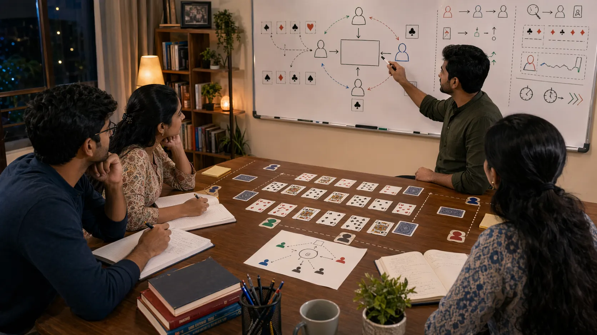

# Game Awareness In Indian Card Games

## Introduction

Game awareness in Indian card games matters because the strongest move on paper can still be weak if the player is reading only their own hand. Table position, visible behavior, changing pressure, and the likely intentions of others all shape what a move really means.

This page explains how readers can widen their view without becoming overwhelmed by too much detail.

---

## Game Awareness Overview

---

## What Is Game Awareness?

Game awareness is the habit of reading the whole table instead of only your own cards. It includes noticing shifts in tempo, identifying who is under pressure, seeing which player is gaining control, and understanding when the round has become more fragile than it first seemed.

---

# 1. Look Beyond Your Own Hand
Good awareness begins when readers stop treating their own hand as the whole story. A move only makes sense inside the wider table context, and strong awareness helps reveal what that context is becoming.

# 2. Track Tempo Changes
Some tables move slowly for long stretches and then suddenly speed up. Awareness helps readers spot those shifts early enough to adjust before their previous plan becomes outdated.

# 3. Notice Who Is Comfortable
A useful awareness habit is to ask which players look settled and which players look squeezed. Comfort often changes the kind of pressure a player can apply, while discomfort changes how reliable their visible behavior is.

# 4. Watch Repeated Behavior
Awareness improves when single actions are compared with repeated tendencies. One bold move may mean very little. A series of consistent choices under similar conditions means much more.

# 5. Separate Signal From Noise
Card tables contain many distractions. Not every pause, reaction, or aggressive-looking move matters equally. Strong awareness depends on ranking the clues instead of trying to treat everything as important.

# 6. Use Awareness To Improve Timing
One of the best uses of awareness is timing. It helps readers act when the table is vulnerable, wait when pressure is misleading, and avoid committing just after the window has already closed.

# 7. Bring Awareness Into Review
After a session, awareness becomes easier to study. Readers can ask which table signal mattered most, whether it was seen in time, and whether their later choices reflected what the table was actually saying.

# 8. Connect Awareness To Better Decisions
Awareness is not a decorative skill. It becomes valuable only when it improves decision quality. The main test is simple: did the wider read help the next move become clearer?

---

## Common Mistakes

- Focusing only on your own cards and ignoring the wider table.
- Treating every visible signal as equally important.
- Missing the moment when the table rhythm clearly changes.

---

## Summary

Game awareness in Indian card games helps readers understand what the whole table is becoming, not just what their own hand can do. When awareness improves, timing, risk judgment, and response quality usually improve with it.

---

## SEO Keywords

game awareness in Indian card games
card game table reading
Indian card game guide
card game awareness
table rhythm

## Related Pages
- [Indian Card Games Fundamentals](./fundamentals.md)
- [Indian Card Games Play Styles](./play-styles.md)
- [Indian Card Games Pattern Recognition](./pattern-recognition.md)
- [Indian Card Games Scenarios](./scenarios.md)
