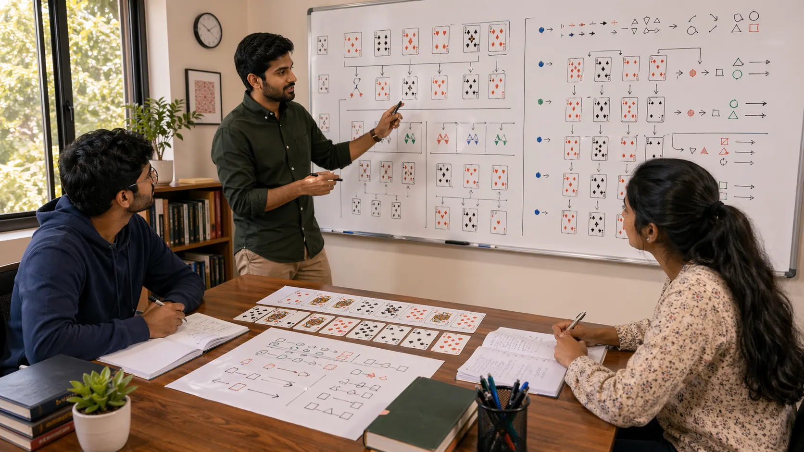

# Pattern Recognition In Indian Card Games: How To Notice What Keeps Returning

## Introduction

Pattern recognition in Indian card games matters because repeated structures help players make sense of the table faster. A familiar rhythm, a familiar kind of pressure, or a familiar reading mistake can reduce confusion and improve response quality.

This page explains how to use pattern recognition well without turning it into lazy assumption. The goal is not to react automatically. The goal is to compare the current spot with earlier ones more intelligently.

---

## Pattern Recognition Overview

---

## What Is Pattern Recognition?

Pattern recognition is the ability to notice repeated structures in hands, rounds, and player behavior. It helps players compare the current situation with earlier ones and judge whether a familiar response is likely to remain useful.

The key word is repeated. Good pattern recognition is built from recurring evidence, not from forcing meaning onto every vivid coincidence.

---

# 1. Recognize Repeated Table Shapes

Many rounds share similar structures even when the exact cards are different. Recognizing those shapes helps players identify where pressure is building and which lines are starting to become fragile.

This does not replace judgment. It simply gives judgment a clearer starting point.

# 2. Compare Similar Hands Carefully

Two hands can look similar while demanding very different priorities. Pattern recognition becomes more reliable when players compare not only the similarity, but also the important difference before choosing a line.

Good pattern work asks both questions: what repeats here, and what changes the answer?

# 3. Notice Behavioral Patterns

Players often reveal useful habits across repeated rounds. Some hesitate in similar spots. Some apply pressure only after comfort appears. Some retreat too late. These patterns matter when they repeat under similar conditions.

Behavior patterns become especially valuable when paired with [Game Awareness In Indian Card Games](./game-awareness.md).

# 4. Avoid Forced Pattern Matching

One of the biggest dangers is seeing a pattern too early because the current round resembles a memorable earlier one. A familiar feeling is not yet a confirmed pattern.

This is where many review mistakes begin. The player did notice something real, but trusted it too quickly.

# 5. Use Patterns To Improve Speed

The main benefit of pattern recognition is practical speed. It helps players reach better questions faster, which matters in uncomfortable or changing rounds.

Pattern recognition should shorten confusion, not shorten thought.

# 6. Confirm Patterns With Context

The same visible action can mean different things in different table environments. A reliable pattern includes context, timing, and repeated evidence, not only visual similarity.

That is why patterns work best as guidance for attention, not as rigid rules.

# 7. Review Patterns After Play

Patterns become easier to trust when they are written down and checked after several sessions. A note that survives repeated comparison is much more useful than a pattern that exists only in memory.

Players who keep a small pattern library often improve faster because they stop relying only on dramatic recollection.

# 8. Connect Recognition To Judgment

Pattern recognition is a support skill. It should help players think more clearly, not make them automatic. The pattern should guide the analysis, not replace it.

If you are not sure whether a repeated spot is truly a pattern or just a memorable result, compare it with [Scenarios In Indian Card Games](./scenarios.md) and [Common Mistakes In Indian Card Games](./common-mistakes.md).

---

## Real Session Example

Pattern recognition becomes tricky when a current spot looks similar to an earlier one but has one important difference. A player may remember that a certain rhythm usually leads to weakness, then act quickly because the pattern feels familiar.

In review, the player may discover that the current spot had a different pressure level, different timing, or a different opponent response. The pattern was not useless, but it was incomplete. It gave a starting point, not a final answer.

This is why strong pattern recognition includes both similarity and difference. The useful question is not only "have I seen this before?" It is also "what changed enough to alter the response?"

---

## Why False Patterns Feel Convincing

False patterns feel convincing because memory favors dramatic examples. A painful mistake or a satisfying win becomes easy to recall, and the mind starts treating it as stronger evidence than it deserves.

Another reason is emotional comfort. A pattern gives the player a story, and stories reduce uncertainty. But a story that feels relieving is not automatically accurate. It still has to be tested against current information.

Reliable pattern recognition depends on repeated evidence, context, and review. Without those three, it becomes confident guesswork.

---

## How To Build A Pattern Library

Keep short notes after sessions. Do not write every detail. Record the situation type, the signal you noticed, the decision made, and whether the same structure has appeared before.

Group patterns by decision problem rather than by outcome. Labels like "late update after rhythm change" or "overtrusting a single clue" are much more useful than simply noting who won.

When a pattern appears again, use it as a question, not a command. Let it guide your attention, then confirm whether the current table still supports the same response.

---

## Common Mistakes

- Declaring a pattern after one vivid example instead of repeated evidence.
- Using patterns as rigid rules without checking the current context.
- Focusing only on opponent patterns and ignoring your own repeated habits.
- Trusting memory alone even though memory favors dramatic spots.
- Mistaking comfort with a pattern for clarity about the current position.

---

## FAQ

### How many examples make a pattern reliable?

There is no perfect number, but one example is almost never enough. The more similar the conditions, the more reliable the pattern becomes.

### Can pattern recognition make me too predictable?

Only if you let it become automatic. Good pattern recognition improves questions, not robotic behavior.

### What is the best way to improve pattern recognition?

Review repeated situations from your own sessions and keep short notes on what actually mattered.

### Is pattern recognition more important than awareness?

They work together. Awareness helps you notice what is happening now, and pattern recognition helps you compare it to what has happened before.

### How should I use a pattern during live play?

Use it as a prompt to ask better questions. A pattern can tell you where to look, but the current position still decides whether the old response is correct.

---

## Summary

Pattern recognition in Indian card games helps players process familiar situations more quickly, but it works best when patterns are tested against context instead of used as shortcuts to certainty. The strongest takeaway is that repeated evidence should guide attention, not replace judgment.

---

## SEO Keywords

pattern recognition in Indian card games
card game strategy
Indian card game guide
card game patterns
table pattern reading

## Related Pages
- [Game Awareness In Indian Card Games](./game-awareness.md)
- [Play Styles In Indian Card Games](./play-styles.md)
- [Common Mistakes In Indian Card Games](./common-mistakes.md)
- [Strategic Thinking In Indian Card Games](./strategic-thinking.md)
