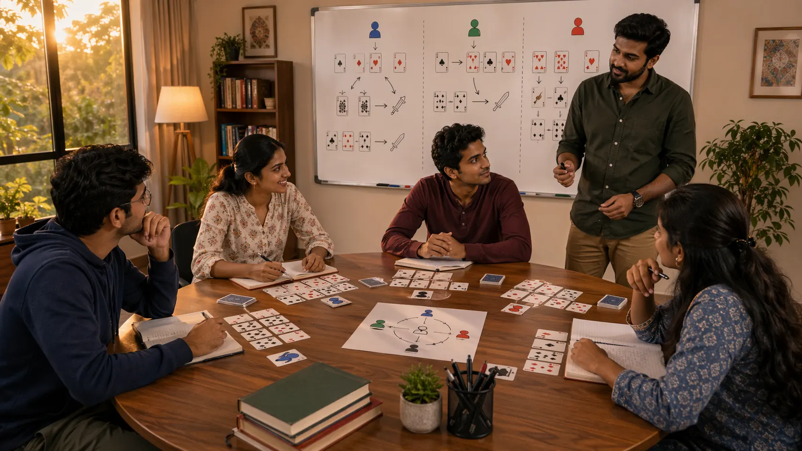

# Play Styles In Indian Card Games: When Pressure, Patience, And Balance Make Sense

## Introduction

Play styles in Indian card games matter because the same hand can become easier or harder to manage depending on who is across the table and how they usually respond under pressure. A style read changes how aggression is interpreted, how much patience is rewarded, and how quickly expectations need to be updated.

This page explains how to study play styles in a grounded way without turning every player into a fixed label. Good style reading is practical, flexible, and tied to repeated evidence.

---

## Play Styles Overview

---

## What Are Play Styles?

Play styles are recurring ways players approach timing, pressure, risk, and value. Some players are active and forceful. Some stay patient and defensive. Others shift styles with the round.

The useful goal is not to describe people neatly. It is to understand how repeated habits affect the current table.

---

# 1. Read Behavior, Not Reputation

A player may have a reputation for aggression or patience, but the stronger read comes from current repeated behavior. Recent choices usually matter more than a label carried into the session beforehand.

Reputation can start the question, but behavior should answer it.

# 2. Notice Style Under Pressure

Play style becomes clearest when the round becomes uncomfortable. Some players tighten too much. Others become forceful too early. Those pressure responses usually reveal more than routine, low-pressure turns.

If you want to understand style honestly, review what happens when comfort disappears.

# 3. Compare Style With Table Context

An active-looking style may come from confidence in one round and insecurity in another. The same visible behavior can mean different things depending on the table state.

That is why style reading works best when paired with [Game Awareness In Indian Card Games](./game-awareness.md).

# 4. Avoid Early Conclusions

One or two rounds are rarely enough to support a strong style read. Players improve faster when they treat early observations as provisional instead of fixed.

Quick labels feel satisfying, but they often create more noise than value.

# 5. Study Your Own Style Too

This topic is not only about opponents. Many players misread their own style shifts. They may think they are balanced when they are actually reacting emotionally to comfort or pressure.

Self-review is what turns play style from personality language into something trainable.

# 6. Use Style To Improve Timing

Style reads are most useful when they improve timing. They can show when pressure is likely to be real, when it is exaggerated, and when a quiet response may outperform a loud one.

Style matters less as identity and more as a timing clue.

# 7. Pair Style With Pattern Recognition

Style reading becomes much stronger when it is supported by repeated patterns rather than surface impressions. This helps prevent a player from building a story from very small samples.

That is why this topic connects naturally with [Pattern Recognition In Indian Card Games](./pattern-recognition.md).

# 8. Keep The Read Flexible

Good style reading stays adjustable. The goal is not to trap anyone in a fixed identity. The goal is to improve the quality of the next choice.

Over time, strong players usually build a default read with flexible updates. That is much more useful than trying to classify everyone completely.

If you want to refine your style reading without turning it into identity, the best companion pages are [Game Awareness In Indian Card Games](./game-awareness.md) and [Strategic Thinking In Indian Card Games](./strategic-thinking.md).

---

## Real Session Example

A player may review a session and say, "I played too passively." Sometimes that is true. But often the deeper issue is timing, not style. The player did not need to become aggressive everywhere. They needed to recognize the one or two moments where the position actually supported action.

The same thing happens with aggressive players. They may believe their style is the problem when the real leak is forcing pressure in unsupported spots. The correction is not always to become patient. It may be to keep the active tendency but require stronger evidence before using it.

This distinction matters because changing your entire style is difficult and often unnecessary. Refining triggers is usually more practical.

---

## Why Players Misread Style

Players often describe style through identity, not evidence. They say they are patient, aggressive, balanced, or creative because that is how they want to think of themselves. Review notes often tell a different story.

A player who believes they are patient may actually be hesitating in clear spots. A player who believes they are aggressive may only become active after frustration. A player who believes they are balanced may simply be inconsistent.

The best way to understand style is to review repeated choices across different emotional states and table rhythms.

---

## How To Refine A Play Style

Start by writing your default tendency in one sentence. Then write the condition where that tendency helps and the condition where it hurts. This keeps the style connected to real situations.

Next, build one adjustment trigger. A patient player might use "act sooner when the position has already given enough information." An aggressive player might use "pause when the move mainly feels strong rather than clearly supported."

The goal is not to erase your natural style. The goal is to make it more responsive to position quality, timing, and risk.

---

## Common Mistakes

- Labeling a player too early and never updating the read.
- Confusing visible activity with true strength.
- Forgetting that your own style may also shift during a session.
- Treating play style as identity instead of response to position.
- Changing your whole style when the real issue is timing.

---

## FAQ

### Which play style is best for improvement?

Usually the one you can review honestly. A style that stays explainable is more useful than one that only feels powerful.

### Is aggressive play always better against weaker opponents?

No. It is often better to refine timing and awareness within your current tendencies first.

### How do I know if I am too passive?

If you often recognize the right moment only after it has already passed, your patience may actually be hesitation.

### Should I try to change my style completely?

Usually no. It is often better to refine awareness and timing within your current tendencies first.

### How do I know whether my style is improving?

Your style is improving when your decisions become easier to explain in review. You should be able to say why the position asked for patience, pressure, or balance.

---

## Summary

Play styles in Indian card games become useful when they help players understand pressure, rhythm, and likely reactions more accurately. The strongest takeaway is that good style reads come from repeated evidence and flexible updates, not from quick labels.

---

## SEO Keywords

play styles in Indian card games
card game strategy
Indian card game guide
player styles
table behavior

## Related Pages
- [Game Awareness In Indian Card Games](./game-awareness.md)
- [Pattern Recognition In Indian Card Games](./pattern-recognition.md)
- [Risk Balance In Indian Card Games](./risk-balance.md)
- [Common Mistakes In Indian Card Games](./common-mistakes.md)
