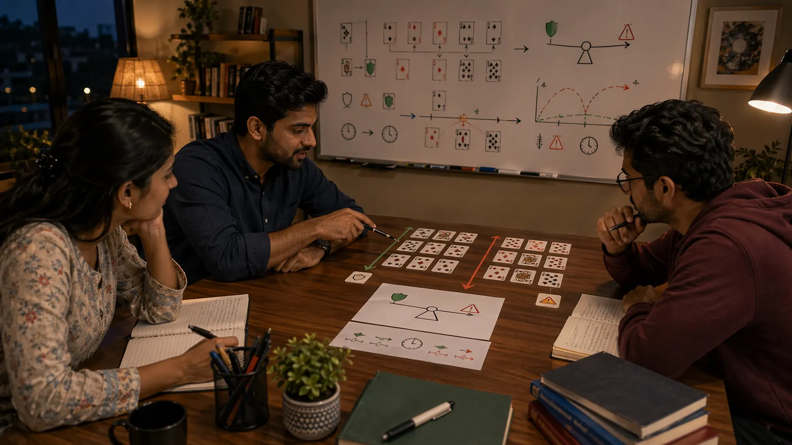

# Risk Balance In Indian Card Games

## Introduction

Risk balance in Indian card games matters because strong play is rarely about avoiding all danger or chasing every upside. Most practical card-game decisions sit between those extremes, and readers improve faster when they learn how to judge that middle ground honestly.

This page looks at how to compare reward, fragility, and recovery before committing too much to one line.

---

## Risk Balance Overview

---

## What Is Risk Balance?

Risk balance is the habit of comparing what a move can gain with what it can cost if the read is wrong or incomplete. In card games, that means looking at hand value, timing, table reactions, and how well the position survives if one assumption fails.

---

# 1. Judge The Cost Of Being Wrong
One of the strongest questions in card-game risk balance is simple: what happens if this line is wrong? A move may look attractive until the recovery cost becomes clear.

# 2. Avoid Reward-Only Thinking
Big upside can distract readers from how many things need to go right for the line to hold. Practical card-game strategy usually gets stronger when reward is compared with stability instead of admired by itself.

# 3. Notice Fragile Hands
Some hands can tolerate uncertainty. Others become weak very quickly if the round shifts. Risk balance becomes much easier when readers first ask how resilient the current hand actually is.

# 4. Use Timing To Judge Commitment
The same risk can be acceptable early, late, or not at all depending on the flow of the table. Good timing is part of risk judgment, not a separate skill.

# 5. Protect Useful Value
Many players improve when they stop thinking only about dramatic gain and start respecting quiet value protection. Preserving a workable position often matters more than one forceful attempt at immediate advantage.

# 6. Avoid Fear-Based Safety
Playing safely is not automatically sound. Some lines are called safe only because they reduce emotional discomfort. A useful risk review asks whether caution is truly practical or merely comforting.

# 7. Review Risk Decisions With Honesty
Risk balance becomes clearer after sessions. Readers can ask how many assumptions were carrying the move, whether the danger was visible, and whether the position stayed recoverable after the decision.

# 8. Connect Risk To The Whole Process
Risk balance works best when it is combined with fundamentals, decision making, and game awareness. Good risk judgment depends on the quality of the read behind it.

---

## Common Mistakes

- Focusing on reward without checking the cost of being wrong.
- Calling a move safe when it is really just emotionally easier.
- Ignoring how timing changes the value of commitment.

---

## Summary

Risk balance in Indian card games improves when readers compare reward, fragility, timing, and recovery more carefully. Good risk judgment is usually calm, practical, and closely tied to the quality of the table read.

---

## SEO Keywords

risk balance in Indian card games
card game strategy
Indian card game guide
risk and reward in card games
table risk judgment

## Related Pages
- [Indian Card Games Decision Making](./decision-making.md)
- [Indian Card Games Fundamentals](./fundamentals.md)
- [Indian Card Games Scenarios](./scenarios.md)
- [Indian Card Games Strategic Thinking](./strategic-thinking.md)
