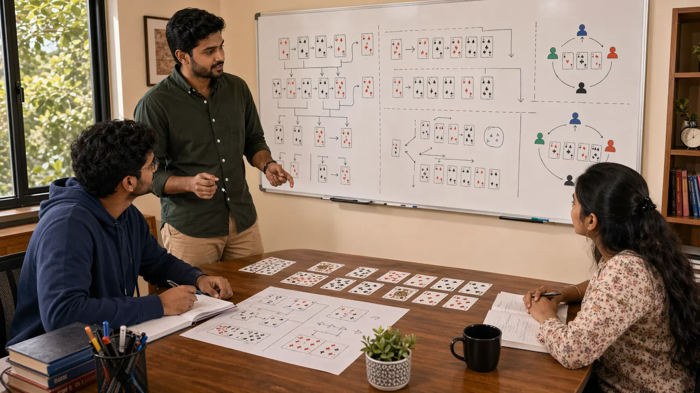

# Scenarios In Indian Card Games: How To Learn From Real Situations Instead Of General Advice

## Introduction

Scenarios in Indian card games matter because players usually learn faster from realistic situations than from broad advice alone. A concrete round, a difficult hand, or a recognizable table shift can teach practical lessons much faster than a long theoretical explanation.

This page explains how scenario study helps players turn live experience into clearer card-game knowledge.

---

## Scenarios Overview

---

## What Are Card-Game Scenarios?

Scenarios are repeatable table situations that help players study judgment in context. They may involve awkward hands, shifting pressure, uncertain reads, defensive turns, or close choices where the right line depends on more than one factor.

Scenarios matter because they keep the pressure, timing, and trade-offs visible.

---

# 1. Use Scenarios To Make Theory Visible

Scenario study helps because it shows where an idea actually appears. Players can connect the concept to a recognizable hand or table shape instead of leaving it as an abstract slogan.

This makes the lesson easier to remember and much easier to apply later.

# 2. Focus On The Turning Point

The most useful part of a scenario is often the moment where the round changes. That might be an overcommitment, a missed update, or a clue that should have changed the whole read.

Good review often begins not at the ending, but at the turning point.

# 3. Compare Similar Situations

Scenarios become stronger when players compare two similar-looking rounds that demand different responses. That comparison reveals which details actually mattered and which details only looked important.

This is one reason scenarios pair well with [Pattern Recognition In Indian Card Games](./pattern-recognition.md).

# 4. Use Scenarios To Build Priorities

A strong scenario teaches what to protect first, what can wait, and where the real danger sits. This is especially helpful for players who feel lost when several choices all look possible.

Scenario study is often the fastest way to turn theory into priority.

# 5. Review Real Sessions, Not Only Ideal Ones

The best scenario notes often come from ordinary games, not perfect study examples. Real sessions reveal hesitation, emotional shortcuts, and unclear reads in a way that polished examples often hide.

Messy scenarios are usually better teachers than neat ones.

# 6. Prepare For Repeated Table Problems

Scenario study becomes practical when it helps the next similar spot feel less chaotic. Familiar structure gives the player a calmer starting point.

This is one of the biggest reasons scenarios improve live play under pressure.

# 7. Keep The Lesson Transferable

The goal is not to memorize every detail. The goal is to understand what kind of pressure or trade-off the round created, so the lesson can travel into other games and other sessions.

A scenario becomes valuable when it teaches the underlying problem, not just the scene.

# 8. Use Scenarios In Post-Game Review

After a session, it helps to record the scenario briefly: what the hand looked like, what the table was doing, where the tension began, and what should be checked earlier next time.

That kind of note becomes more useful over time because it reflects your actual game rather than someone else’s examples.

Scenario work improves most when it feeds back into [Decision Making In Indian Card Games](./decision-making.md) and [Pattern Recognition In Indian Card Games](./pattern-recognition.md).

---

## Real Session Example

Players often remember the ending of a difficult scenario but forget the turning point. They remember the result, the emotional moment, or the final action. In review, the useful lesson usually appears earlier, when the position first changed.

For example, the key moment may not be the final decision. It may be the first missed signal, the first overcommitment, or the first time the player refused to update an old read. Once that turning point is named, the scenario becomes much more useful.

Good scenario study asks: what changed, when did it change, and what should have changed in my thinking?

---

## Why Scenario Lessons Fail To Transfer

Scenario lessons fail when players memorize the surface details instead of the underlying decision problem. They remember one exact spot and try to copy the same response into a different situation.

A transferable lesson names the real issue. Was the problem timing, risk balance, emotional recovery, awareness, or classification? Once that is clear, the scenario can travel into other rounds.

The purpose of a scenario is not to create a script. It is to make a type of pressure easier to recognize next time.

---

## How To Write Better Scenario Notes

Use four lines: setup, turning point, decision, lesson. The setup explains the position. The turning point names what changed. The decision records what you did. The lesson explains what to check earlier next time.

Keep scenario notes short. Long notes often bury the lesson under too much detail. A useful scenario note should be easy to reread and easy to compare with later spots.

If you build several notes, group them by decision problem: rushed choices, missed rhythm shifts, bad risk, false patterns, or style mistakes.

---

## Common Mistakes

- Treating scenarios like scripts instead of learning tools.
- Reviewing one scenario in isolation without comparing it to similar spots.
- Missing the turning point where the situation actually changed.
- Writing long summaries without extracting one reusable lesson.
- Remembering the exact scene but forgetting the broader principle.

---

## FAQ

### Should I study invented scenarios or only real ones?

Real scenarios are usually better for honest review, but invented scenarios can still help if they are built around realistic pressure and trade-offs.

### What should I write down from a scenario?

The setup, the turning point, the decision, and the lesson. That is usually enough.

### How many scenarios should I review after a session?

Usually one to three meaningful spots are enough. Depth is more useful than volume.

### Why do scenarios help under pressure?

Because familiarity lowers confusion. When the structure feels known, your mind stays clearer.

### How detailed should a scenario note be?

Detailed enough to preserve the decision problem, but short enough to reread. If the note does not identify the turning point, it is usually too vague.

---

## Summary

Scenarios in Indian card games help players turn lived table experience into clearer judgment. The strongest takeaway is that scenario notes work best when they stay tied to turning points, real pressure, and lessons that can transfer into similar future spots.

---

## SEO Keywords

scenarios in Indian card games
card game strategy
Indian card game guide
card game situations
table scenarios

## Related Pages
- [Decision Making In Indian Card Games](./decision-making.md)
- [Game Awareness In Indian Card Games](./game-awareness.md)
- [Risk Balance In Indian Card Games](./risk-balance.md)
- [Common Mistakes In Indian Card Games](./common-mistakes.md)
