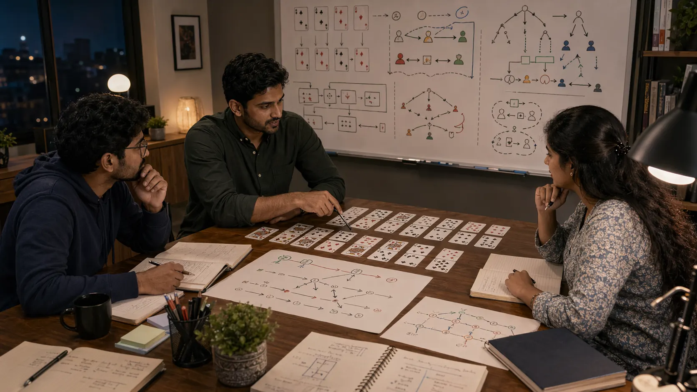

# Strategic Thinking In Indian Card Games: How To Plan Beyond The Current Move

## Introduction

Strategic thinking in Indian card games matters because a good move is not only about the current hand. It is also about what kind of future position the player is creating, how much flexibility will remain, and whether the table is being guided toward a useful shape.

This page explains how to think ahead without becoming rigid or overly theoretical. Strong strategy should make the next phase clearer, not more dramatic.

---

## Strategic Thinking Overview

---

## What Is Strategic Thinking?

Strategic thinking is the habit of linking the current move to a broader plan. In card games, that means understanding how local choices affect future pressure, hand development, defensive options, and the ability to adapt if the round changes direction.

The point is not to predict everything. The point is to create a future you can still manage.

---

# 1. Think Beyond The Immediate Hand

Strategic play begins when a player stops judging a move only by what it does right now. The better question is what shape the move creates and whether that shape is actually desirable.

Some moves solve the immediate problem but quietly make the next decision much harder.

# 2. Link Small Decisions To Larger Goals

Each local choice should support a wider goal, whether that goal is value protection, controlled pressure, steady hand development, or denying comfort to the table.

Without a wider goal, decisions become isolated and strategy starts disappearing.

# 3. Use A Short Planning Horizon

Strong strategy often looks one or two steps ahead, not ten. A short planning horizon is practical because it allows foresight without pretending that future information is already known.

Planning too far ahead often creates elegant stories and weak decisions.

# 4. Respect Trade-Offs

Strategic thinking becomes realistic when the player accepts that most plans exchange one benefit for one cost. Better planning comes from choosing the trade-off the position can actually support.

There is rarely a perfect line with no cost attached to it.

# 5. Leave Space To Adapt

A useful plan gives direction without becoming brittle. Players improve faster when they treat a plan as a working shape that can change after meaningful new information appears.

Rigid strategy is often just old confidence surviving too long.

# 6. Consider The Opponent Story

Strategy becomes stronger when it includes what the other side is likely trying to create. That perspective often reveals timing windows, danger points, and places where a quiet move may outperform a forceful one.

Thinking strategically from only one side of the table usually leaves major blind spots.

# 7. Judge Strategy By Repeatability

A line that looks good once may still be weak over repeated play. Strategic thinking becomes more trustworthy when the player asks whether the plan would still make sense across many similar rounds.

This is why strategy and review should stay closely connected.

# 8. Turn Strategy Into Review

After the session, useful review questions include: what did the plan hope to create, what actually changed, and should the plan have been updated earlier? Those questions turn strategy into a repeatable skill instead of a vague story.

This page connects especially well with [Decision Making In Indian Card Games](./decision-making.md) for move quality and [Advanced Concepts In Indian Card Games](./advanced-concepts.md) for higher-level adjustments once the planning habit is stable.

---

## Real Session Example

Strategic mistakes often look fine in the moment. A move may solve the immediate problem, create pressure, or protect value right away. The issue appears later when that same move leaves fewer options, creates a predictable pattern, or makes the next decision much harder.

In review, this often sounds like, "The first move worked, but I had no good follow-up." That is a strategic-thinking problem. The move was judged by its immediate effect, not by the future shape it created.

Good strategy does not require predicting everything. It requires noticing whether the current move builds a future the player can still manage after the table responds.

---

## Why Plans Become Rigid

Plans become rigid when players become attached to the idea that made sense earlier. Once a plan feels smart, it becomes harder to abandon, and the player starts defending the plan instead of reading the table.

Another reason is fear of uncertainty. Updating a plan means admitting that the position changed. But flexible strategy is not weakness. It is what keeps the plan alive in real play.

A practical plan should have a direction, a reason, and an update trigger.

---

## How To Practice Strategic Thinking

Before taking a meaningful action, ask: what am I trying to create? The answer should be specific enough to review later. "Play better" is not a strategic goal. "Keep options open while testing the table reaction" is much more useful.

After the session, compare the expected shape with the actual one. Did the move create the pressure, control, or flexibility you expected? If not, was the plan wrong, the timing wrong, or the update too late?

That process turns strategy into something repeatable instead of decorative.

---

## Common Mistakes

- Making each decision separately without a clear aim for the phase.
- Planning too far ahead and losing touch with current information.
- Ignoring the trade-off that comes with the chosen line.
- Refusing to update a plan after the position changes.
- Thinking strategically only from your own side of the table.

---

## FAQ

### Do I need to think many turns ahead to be strategic?

No. Good strategy often looks only one or two steps ahead, but it does so clearly and honestly.

### What is the easiest way to improve strategic thinking?

Ask what future shape the current move is trying to create. That keeps planning connected to the real decision.

### Why do my plans fall apart so quickly?

Often because they were too rigid or because they were built before enough information was available.

### How can I review strategy after a session?

Ask what you expected the move to create, what actually changed, and whether the plan should have been updated earlier.

### What is the simplest strategic habit to build first?

Before a key move, name what you want the next phase to look like. That keeps strategy grounded in live play.

---

## Summary

Strategic thinking in Indian card games helps players create better future positions without losing touch with the current table. The strongest takeaway is that good strategy is clear, flexible, and honest about trade-offs.

---

## SEO Keywords

strategic thinking in Indian card games
card game strategy
Indian card game guide
card game planning
table strategy

## Related Pages
- [Decision Making In Indian Card Games](./decision-making.md)
- [Risk Balance In Indian Card Games](./risk-balance.md)
- [Advanced Concepts In Indian Card Games](./advanced-concepts.md)
- [Indian Card Games Fundamentals](./fundamentals.md)
