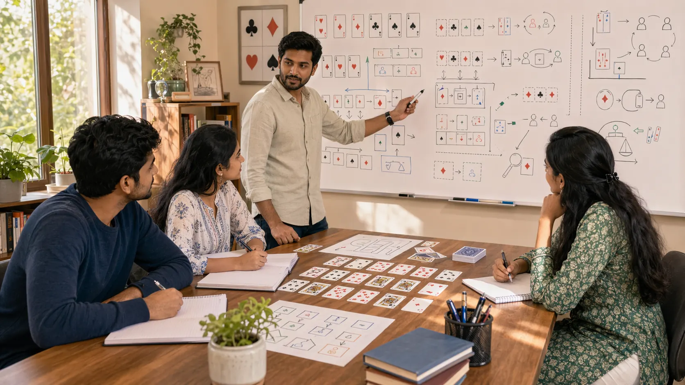

# Indian Card Games Hub: Shared Study Notes For Better Table Judgment

## Introduction

Indian Card Games Hub is built for readers who want a realistic way to study card-game thinking. Many Indian card games look different on the surface, but they often reward the same deeper habits: better hand judgment, steadier timing, stronger table awareness, and calmer review after the round ends.

This repository brings those shared ideas into one place. Instead of treating every game as a separate world, it focuses on the recurring patterns that travel across familiar card tables and explains why they matter in actual play.

The goal is simple: make the material easy to read, useful to review, and detailed enough to help both beginner readers and more deliberate intermediate players.

---

## Site Overview

---

## What Is Indian Card Games Hub?

Indian Card Games Hub is an educational reference for shared card-game skills. It focuses on recurring ideas that appear across many Indian card games, including hand reading, value protection, tempo, pressure, pattern recognition, risk balance, and disciplined decision making.

The point is not to collect random tips. The point is to help readers understand how stronger judgment is built and how repeated mistakes can be reviewed more honestly.

---

# 1. Start With Shared Card-Game Basics

Readers usually improve faster when they begin with common foundations instead of chasing advanced tricks too early. Hand structure, sequencing, table discipline, and reading pressure become easier to use once the basic language of the game feels stable.

# 2. Use The Pages As A Learning Path

The content works best as a sequence. [Indian Card Games Fundamentals](./content/fundamentals.md) explains the base layer, [Common Mistakes In Indian Card Games](./content/common-mistakes.md) shows where that layer breaks, and [Decision Making In Indian Card Games](./content/decision-making.md) explains what to do when the position becomes uncomfortable.

# 3. Compare Ideas Across Games

One advantage of a broader card-games repository is that readers can notice what stays useful from one game to another. That comparison builds stronger judgment than memorizing isolated advice for only one format.

# 4. Connect Reading To Real Table Situations

The material becomes much more useful when readers compare each page with a recent session. A good article should help explain a real hand, a real tempo shift, or a real reading mistake.

# 5. Review Repeated Errors Before Advanced Ideas

Many players improve faster when they remove repeated weak habits before adding more complexity. That is why mistakes, awareness, pattern recognition, and risk balance matter so much here.

# 6. Treat Strategy As A Practical Process

The later pages deepen the thinking process rather than replacing it. [Strategic Thinking In Indian Card Games](./content/strategic-thinking.md) and [Advanced Concepts In Indian Card Games](./content/advanced-concepts.md) become most useful when the player already has a stable way to observe, classify, and review.

---

## Real Session Example

Imagine a player finishing a session that felt inconsistent. The player remembers one dramatic mistake near the end, but the review shows the real problem started earlier. The first leak was poor observation. The second was a rushed decision. The final mistake only made the earlier problems visible.

This is how the hub is meant to be used. The player might begin with [Indian Card Games Fundamentals](./content/fundamentals.md), then move to [Decision Making In Indian Card Games](./content/decision-making.md), and finally use [Common Mistakes In Indian Card Games](./content/common-mistakes.md) to name the repeated error.

The point is not to read everything at once. The point is to follow the actual problem through the library until the repeated thinking pattern becomes clear.

---

## Why Players Study In The Wrong Order

Many players start with advanced ideas because advanced topics feel more exciting. But if the player still misreads basic pressure, ignores table rhythm, or reviews only results, advanced theory often adds more noise than value.

A better order is simple: fundamentals, common mistakes, decision making, awareness, pattern recognition, risk balance, scenarios, strategic thinking, and then advanced concepts. That order follows the way real sessions usually go wrong.

This does not make advanced ideas unimportant. It simply means they become useful only when the earlier layers are already steady enough to support them.

---

## How To Use The Hub As A Weekly Study Routine

Choose one article for the week. Read it once without taking notes, then read it again with one recent session in mind. Pick one section that describes a mistake or decision you recognize.

During the next session, test one small behavior. If the article is about awareness, track one table signal. If it is about risk, name the downside before taking a thin line. If it is about scenarios, record one turning point after the session.

At the end of the week, write a short review: what changed, what stayed difficult, and which page should come next. That creates a study loop realistic enough to maintain.

---

## Suggested Learning Paths

### If You Keep Making Rushed Decisions

Start with [Indian Card Games Fundamentals](./content/fundamentals.md), then read [Decision Making In Indian Card Games](./content/decision-making.md), followed by [Risk Balance In Indian Card Games](./content/risk-balance.md).

### If You Keep Missing Table Changes

Start with [Game Awareness In Indian Card Games](./content/game-awareness.md), then read [Pattern Recognition In Indian Card Games](./content/pattern-recognition.md), followed by [Scenarios In Indian Card Games](./content/scenarios.md).

### If Your Style Feels Inconsistent

Start with [Play Styles In Indian Card Games](./content/play-styles.md), then read [Common Mistakes In Indian Card Games](./content/common-mistakes.md), followed by [Strategic Thinking In Indian Card Games](./content/strategic-thinking.md).

### If You Want To Study Advanced Ideas

Read [Strategic Thinking In Indian Card Games](./content/strategic-thinking.md) and [Pattern Recognition In Indian Card Games](./content/pattern-recognition.md) first. Then move into [Advanced Concepts In Indian Card Games](./content/advanced-concepts.md).

---

## Common Mistakes

- Reading pages quickly without connecting them to real hands or rounds.
- Looking for one perfect rule instead of learning how trade-offs work.
- Jumping into advanced strategy before basic hand reading and timing are steady.
- Treating study as content consumption instead of review practice.
- Ignoring related pages that explain the next layer of the same problem.

---

## FAQ

### Is this hub only for beginners?

No. Beginners can use it because the language stays clear, but intermediate players often get more value because they already have real mistakes to compare against the pages.

### How should I read these pages for actual improvement?

Read one page at a time, then connect it to one or two recent decisions from play. The content is most useful when tied to memory, not just skimmed.

### Why do the articles focus so much on mistakes and review?

Because repeated errors are easier to fix than vague goals like "play smarter." Review turns frustration into something specific and trainable.

### Which pages should I read first?

Start with fundamentals, common mistakes, and decision making. After that, move into awareness, pattern recognition, and risk balance before the more advanced pages.

### How often should I use the hub?

Once or twice a week is enough if you connect the reading to real play. One article paired with one honest session review is more valuable than reading the whole hub quickly.

---

## Summary

Indian Card Games Hub is most useful when readers treat it as a study guide for shared card-game judgment. Start with the basics, connect each page to real table situations, and use the library to reduce repeated errors more honestly over time.

---

## SEO Keywords

Indian card games
card game strategy
Indian card game guide
card game fundamentals
table reading

## Related Pages
- [Indian Card Games Fundamentals](./content/fundamentals.md)
- [Decision Making In Indian Card Games](./content/decision-making.md)
- [Common Mistakes In Indian Card Games](./content/common-mistakes.md)
- [Game Awareness In Indian Card Games](./content/game-awareness.md)
- [Strategic Thinking In Indian Card Games](./content/strategic-thinking.md)
